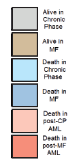

# This is *automatically* generated report based on input data

### Report created on `r Sys.time()`

### Software ver. # 0.0.1

## Patient description:

* #### `r params$n`

* #### `r params$m`

* #### `r params$d`


```{r echo=FALSE}


newdataplot(params$plt)

```

 <!-- need to figure out how to move it to the left! -->


