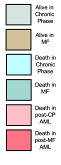

## MPN prediction model report


### Report created on `r Sys.time()` (UTC)

#### Software ver. # 1.1.0

## Patient description:

#######

* #### Patient selected: `r params$upn`

* #### Initial diagnosis: `r params$diagn`

* #### Mutations detected: `r params$mut`

* #### `r params$dem`


```{r echo=FALSE}

layout(matrix(c(1,1,1,2), 1, 2))
newdataplot(params$plt)


```
 

### Patient Outcomes:

#### `r params$MEFS`

#### `r if (params$out_mf=="NA"){paste("")}else{params$out_mf}`
#### `r if (params$out_m=="NA"){paste("")}else{params$out_m}`


